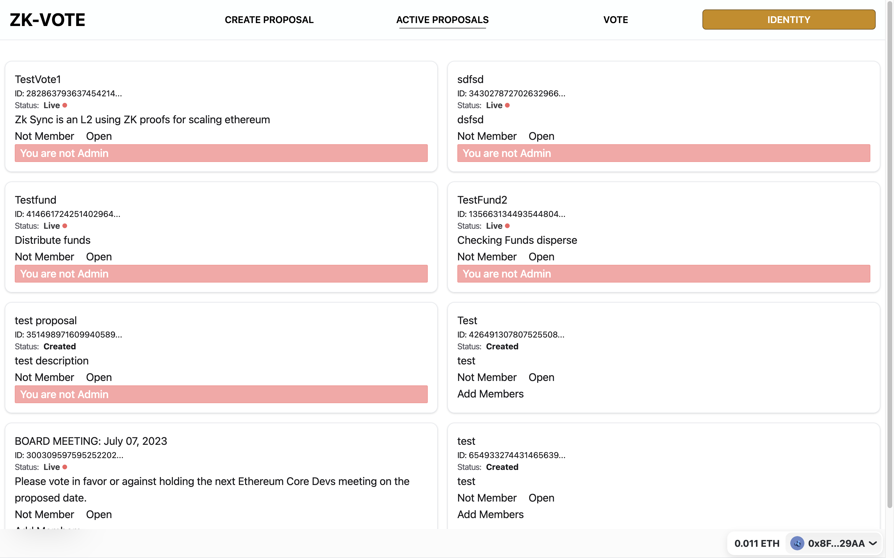

## 🔢✅🗳 ZK-VOTING

## A Fork of [supernovahs](https://github.com/supernovahs)' Zero-Knowledge Voting Dapp

> 🌐 CREATE IDENTITY - Derived from your externally owned account's public key, you receive: a *Nullifier*, a *Trapdoor*, and a *Commitment*

> 📄 PROVE IDENTITY - Use your Commitment ID to vote on on-chain proposals

### 

> Olde Demo Images -- New screenshots to be uploaded soon, see Gif or demo yourself (full experience requires browser injected Ethereum wallet)

### 
### 
### 
### 
### 
### 
### 
### 

---
## 📦 Clone this dApp

```bash
git clone https://github.com/pryority/web3-youtube.git
```

### 🔁 Run this dApp
```
yarn install
yarn dev
```

### [Main voting contract](https://github.com/supernovahs/ClickedZKvote-frontend/blob/main/src/Contract.sol)
### [This Project Was Forked From This Person](https://github.com/supernovahs)
